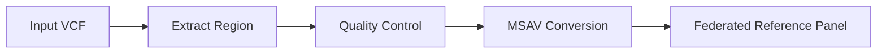

# Federated Genotype Imputation Pipeline

[](https://opensource.org/licenses/MIT)
[](https://github.com/openwdl/wdl)
[](https://hub.docker.com/r/mamana/imputation)
[](https://github.com/mamanambiya/generate-ref-panel-workshop-2025/actions/workflows/docker-build.yml)
[](https://github.com/mamanambiya/generate-ref-panel-workshop-2025/actions/workflows/test-wdl.yml)

## GA4GH Hackathon 2025 - African Genomics Team

A production-ready WDL workflow for processing VCF files into MSAV format to enable federated genotype imputation networks while preserving data sovereignty.

## Table of Contents

- [Overview](#overview)
- [Quick Start](#quick-start) 
- [Workflow Architecture](#workflow-architecture)
- [Installation](#installation)
- [Usage](#usage)
- [Testing](#testing)
- [Deployment](#deployment)
- [Contributing](#contributing)

## Overview

### What This Pipeline Does
1. **Extract genomic regions** from VCF files using bcftools
2. **Apply quality control** filters (MAF, call rate, variant type)
3. **Convert to MSAV format** using Minimac4 for federated imputation
4. **Generate comprehensive statistics** and validation reports

### Key Features
- **Data Sovereignty**: Raw genomic data never leaves your institution
- **African Genomics Focus**: Optimized for H3Africa and AWI-Gen reference panels
- **GA4GH Compliant**: Standard WDL format for cross-platform execution
- **Production Ready**: Comprehensive error handling and validation
- **Scalable**: Containerized approach supports large datasets

## Quick Start

### 1. Prerequisites
- Docker or Singularity
- WDL execution engine (Cromwell, DNAstack Workbench, Terra, etc.)
- Input VCF file (bgzip compressed and indexed)

### 2. Run Test Pipeline
```bash
# Pull the container (with specific SHA256 for security)
docker pull mamana/minimac4-all@sha256:58d007608d94855df2abd67076795f20136e1e97e6a9f65afc3e54c373bd1d8f

# Or simply pull the latest tag
docker pull mamana/minimac4-all

# Run test workflow
java -jar cromwell.jar run federated_imputation_pipeline.wdl -i test_input.json
```

### 3. Expected Output
- `federated_panel.msav` - Ready for federated imputation networks
- Quality-controlled VCF files with statistics
- Comprehensive processing reports

## Workflow Architecture

### Simplified Design
```
federated_imputation_pipeline.wdl        # Single WDL file with all tasks
test_input.json                          # Test configuration
test_chr22_region_bgzip.vcf.gz           # Test data
test_chr22_region_bgzip.vcf.gz.csi       # Test data index
```

### Pipeline Flow


### Data Flow & Sovereignty
- **Input**: VCF files remain in your secure environment
- **Processing**: All computation happens within your infrastructure
- **Output**: MSAV files enable collaboration without data sharing
- **Result**: Federated imputation while maintaining data sovereignty

## Installation

### Container Requirements
The pipeline uses the validated container: `mamana/imputation:minimac4-all`

**Contains:**
- Minimac4 v4.1.6 (MSAV conversion)
- bcftools 1.20 (VCF processing)
- All dependencies (bc, bgzip, tabix)

### Local Setup
```bash
# Clone repository
git clone https://github.com/mamanambiya/generate-ref-panel-workshop-2025.git
cd generate-ref-panel-workshop-2025

# Pull container
docker pull mamana/imputation:minimac4-all

# Download Cromwell (if needed)
curl -L -o cromwell.jar https://github.com/broadinstitute/cromwell/releases/download/85/cromwell-85.jar
```

## Usage

### Input Configuration

Create an input JSON file based on your requirements:

**For Production (Cloud)**
```json
{
  "FederatedImputationPipeline.input_vcf": "gs://your-bucket/h3africa_chr22.vcf.gz",
  "FederatedImputationPipeline.chromosome": "22",
  "FederatedImputationPipeline.start_position": 16000000,
  "FederatedImputationPipeline.end_position": 51304566,
  "FederatedImputationPipeline.output_prefix": "h3africa_chr22_federated"
}
```

**For Local Testing**
```json
{
  "FederatedImputationPipeline.input_vcf": "test_chr22_region_bgzip.vcf.gz",
  "FederatedImputationPipeline.chromosome": "22",
  "FederatedImputationPipeline.start_position": 16000000,
  "FederatedImputationPipeline.end_position": 16990000,
  "FederatedImputationPipeline.output_prefix": "test_panel"
}
```

**For Azure Batch**
```json
{
  "FederatedImputationPipeline.input_vcf": "$AZ_BATCH_TASK_WORKING_DIR/test_chr22_region_bgzip.vcf.gz",
  "FederatedImputationPipeline.chromosome": "22",
  "FederatedImputationPipeline.start_position": 16000000,
  "FederatedImputationPipeline.end_position": 16990000,
  "FederatedImputationPipeline.output_prefix": "test_panel"
}
```

### Execution Commands

**Local Execution with Cromwell**
```bash
java -jar cromwell.jar run \
  federated_imputation_pipeline.wdl \
  -i test_input.json
```

**DNAstack Workbench**
1. Upload `federated_imputation_pipeline.wdl`
2. Upload input JSON configuration
3. Execute through web interface

**Terra/AnVIL**
1. Import workflow to workspace
2. Configure inputs via UI
3. Run workflow

### Parameter Reference

| Parameter | Type | Default | Description |
|-----------|------|---------|-------------|
| `input_vcf` | File | Required | Input VCF file (bgzip compressed) |
| `chromosome` | String | Required | Target chromosome (e.g., "22") |
| `start_position` | Int | Required | Start genomic position |
| `end_position` | Int | Required | End genomic position |
| `maf_threshold` | Float | 0.01 | Minimum allele frequency |
| `call_rate_threshold` | Float | 0.95 | Minimum call rate |
| `remove_indels` | Boolean | true | Keep SNPs only |
| `output_prefix` | String | "federated_panel" | Output file prefix |
| `compression_level` | Int | 5 | MSAV compression (1-9) |

## Testing

### Quick Testing
Run the pipeline with included test data to verify functionality:

#### Local Testing
```bash
# Run the pipeline with test data
java -jar cromwell.jar run federated_imputation_pipeline.wdl -i test_input.json

# Validate output
ls -la test_federated_panel*
file test_federated_panel.msav
```


### Manual Validation
```bash
# Validate MSAV output
file output/federated_panel.msav
# Expected: Zstandard compressed data

# Check variant counts
bcftools view -H output/quality_controlled.vcf.gz | wc -l
```

### Test Data
- `test_chr22_region_bgzip.vcf.gz` - 100 variants from chromosome 22
- `test_chr22_region_bgzip.vcf.gz.csi` - Index file
- `test_input.json` - Test configuration
- Expected output: ~18 variants after QC, ~5KB MSAV file

## Deployment

### Simple Local Testing
No complex CI/CD setup required - just run locally:

### Automated Container Builds (GitHub Actions)

The Docker container is automatically built and published to GitHub Container Registry on every push:

- **Container Registry**: `ghcr.io/mamanambiya/federated-imputation:latest`
- **Automated Builds**: Multi-platform (linux/amd64, linux/arm64)
- **WDL Validation**: All workflow files are automatically validated
- **Integration Testing**: Container functionality tested on every build

**Using the automated container:**
```bash
# Pull the latest automated build
docker pull ghcr.io/mamanambiya/federated-imputation:latest

# Use with GitHub Container Registry WDL variant
java -jar cromwell.jar run federated_imputation_pipeline_github.wdl -i test_input.json
```

**Build Status**: Check the badge above for current build status. Green means the latest container is ready for use!

### DNAstack Workbench
1. **Upload Files**:
   - `federated_imputation_pipeline.wdl`
   - `test_input.json` (or your own configuration)

2. **Configure Container**: Ensure `mamana/imputation:minimac4-all` is available

3. **Execute**: Run workflow through web interface

### Cloud Platforms

**Google Cloud (Terra)**
- Import workflow to Terra workspace
- Configure with Google Cloud Storage paths
- Execute with Cromwell backend

**AWS (Amazon Genomics)**
- Deploy using AWS Batch backend
- Configure S3 storage paths
- Scale with EC2 instances

**Azure Batch**
- Use Azure Batch for execution
- Configure Azure Blob Storage for input/output
- Upload files to working directory before execution
- Use `test_input_azure.json` for Azure-specific paths
- Ensure Docker container `mamana/imputation:minimac4-all` is accessible

### HPC Clusters
```bash
# Singularity setup
singularity pull docker://mamana/imputation:minimac4-all

# SLURM submission script
sbatch --job-name=federated-imputation run_pipeline.sh
```

## Troubleshooting

### Azure Batch Issues

**Exit Code 10 (ExtractRegion Task)**
- Ensure test data files are uploaded to the batch task working directory
- Check that file paths in input JSON match Azure Batch environment
- Verify Docker container accessibility from Azure

**File Path Issues**
- Use `test_input_azure.json` for Azure Batch deployments
- Ensure all input files are in the correct Azure working directory
- Check Azure Batch task file management configuration

**Docker Container Issues**
- Verify `mamana/imputation:minimac4-all` is accessible from Azure
- Check Azure container registry permissions
- Ensure proper network connectivity for Docker Hub

## Production Use Cases

### African Genomics Research
- **H3Africa Consortium**: Process reference panels while maintaining data sovereignty
- **AWI-Gen Study**: Enable cross-site imputation without data transfer
- **Population Studies**: Create federated imputation networks across institutions

### International Collaboration
- **Multi-site Studies**: Collaborative research without data sharing
- **Reference Panel Development**: Contribute to global resources while preserving privacy
- **Regulatory Compliance**: Meet data protection requirements while enabling research

## Performance

### Benchmarks
- **Small regions** (100K variants): 5-10 minutes
- **Chromosome arm** (500K variants): 15-30 minutes  
- **Whole chromosome** (2M+ variants): 1-2 hours

### Resource Requirements
- **CPU**: 2-4 cores recommended
- **Memory**: 4-8 GB depending on dataset size
- **Storage**: 2x input file size for temporary files

## Contributing

### Development Guidelines
1. Follow WDL best practices for task organization
2. Include comprehensive parameter metadata
3. Add validation and error handling
4. Update documentation for new features

### Simple Development Workflow
1. Clone repository
2. Make changes to `federated_imputation_pipeline.wdl`
3. Test with `test_input.json`
4. Submit PR with clear description

## License

This project is licensed under the MIT License - see [LICENSE](LICENSE) file for details.

## Support

### Documentation
- [WDL Specification](https://github.com/openwdl/wdl)
- [GA4GH Standards](https://www.ga4gh.org/)
- [Minimac4 Documentation](https://genome.sph.umich.edu/wiki/Minimac4)

### Contact
- **GA4GH Hackathon 2025 Team**
- **African Genomics Initiative**
- **Email**: [team@afrigenomics.org](mailto:team@afrigenomics.org)

---

## Ready for African Genomics Research!

This pipeline enables federated genotype imputation across African institutions while preserving data sovereignty and promoting collaborative genomics research.

**Container**: `mamana/imputation:minimac4-all`  
**Workflow**: Production-ready WDL pipeline  
**Output**: MSAV files for federated networks  
**Status**: **READY FOR DEPLOYMENT**
